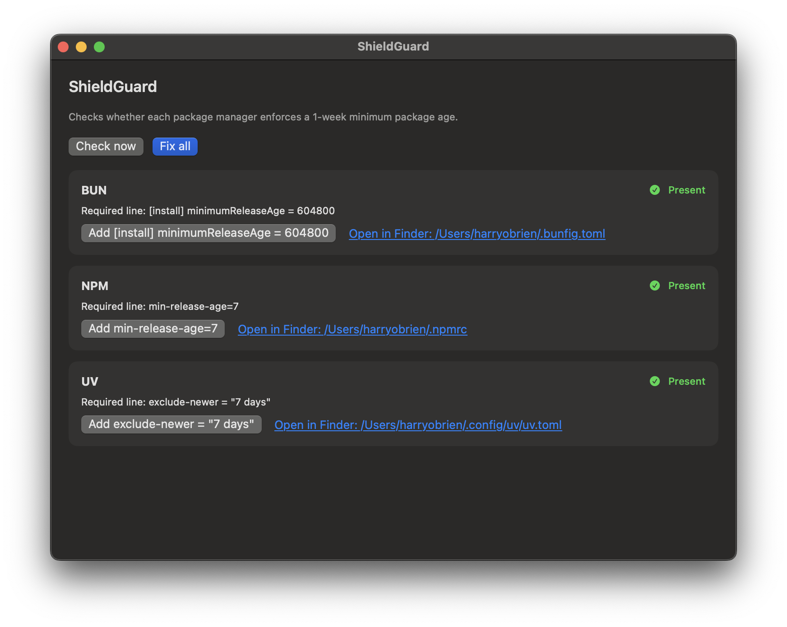

# ShieldGuard

ShieldGuard is a lightweight macOS desktop app that checks whether installed package managers are configured to prefer packages that are at least 1 week old.

It is intentionally simple:
- No menu bar app
- No background polling
- No always-on service
- Just a clean window with manual checks and fixes

## Screenshot



## What It Checks

ShieldGuard only checks package managers that are installed on your machine:

- `npm` -> `~/.npmrc` contains `min-release-age=7`
- `pnpm` -> `~/Library/Preferences/pnpm/rc` contains `minimum-release-age=10080`
- `uv` -> `~/.config/uv/uv.toml` contains `exclude-newer = "7 days"`
- `bun` -> `~/.bunfig.toml` contains `[install] minimumReleaseAge = 604800`

If a package manager is not installed, ShieldGuard skips it entirely.

## Features

- `Check now` button to refresh status
- `Fix all` button to add required lines for all installed managers
- Per-manager `Add ...` buttons
- Per-manager `Open in Finder` links for manual inspection

## Build And Run

### Requirements

- macOS 14+
- Xcode Command Line Tools (Swift toolchain)

### Run from source

```bash
cd /Users/harryobrien/coding/ShieldGuard
swift build
swift run ShieldGuardApp
```

### Open the packaged app

```bash
open /Users/harryobrien/coding/ShieldGuard/dist/ShieldGuard.app
```

## Notes

- ShieldGuard writes files atomically and stores backups in:
  - `~/Library/Application Support/ShieldGuard/backups`
- This tool is a configuration helper, not a complete software supply chain security solution.

## Roadmap

- Optional project-level Bun config support (`bunfig.toml` in working repos)
- Optional export/report mode for CI compliance checks

## License

MIT (recommended for public release; add a `LICENSE` file before tagging v1.0.0).
